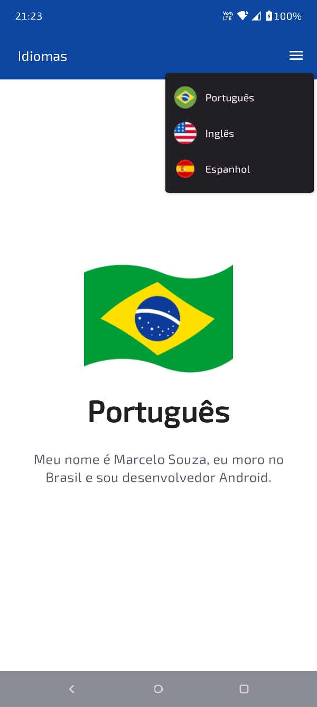
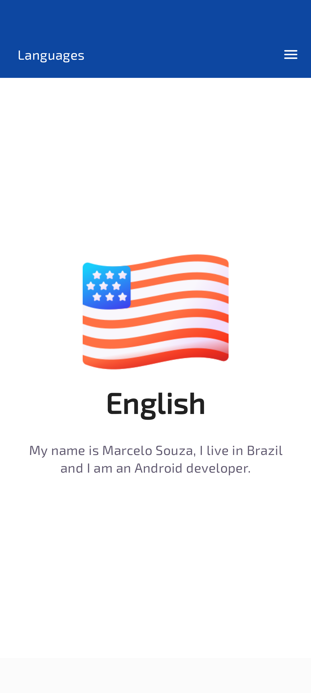
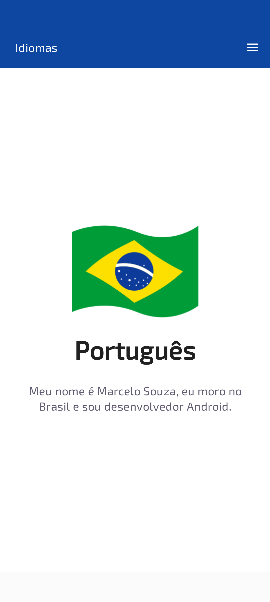
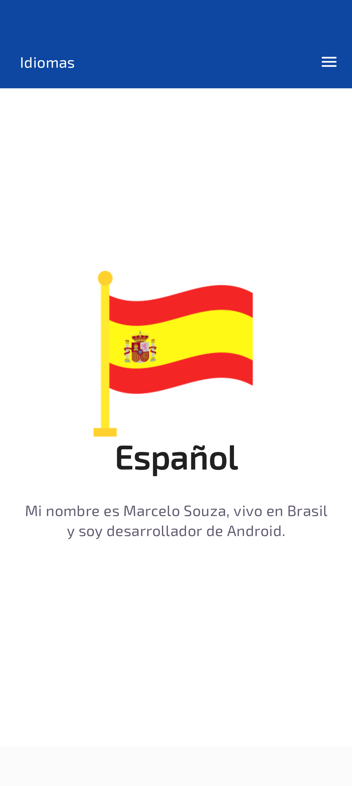

# Idiomas - Jetpack Compose

> Este projeto foi desenvolvido com o objetivo de aprofundar meus conhecimentos no uso do  
> **DataStore** no Android. A aplicação permite ao usuário selecionar um idioma para os textos,  
> garantindo que a escolha seja persistida mesmo após fechar e reabrir o app.

## ⚙️ Tecnologias utilizadas

- **Kotlin**: Linguagem principal de desenvolvimento.
- **Jdk 21**: Versão do Java usada no desenvolvimento.
- **Jetpack Compose**: Framework para construção de UI nativa.
- **Koin Annotations**: Biblioteca de injeção de dependências.
- **DataStore**: Solução para persistência de dados.
- **JUnit**: Biblioteca de testes unitários.
- **Espresso**: Biblioteca de testes instrumentados.
- **MockK**: Biblioteca para criação de mocks em Kotlin.
- **Shot (Karumi)**: Biblioteca para testes de **Snapshot**.

## 📚 Estrutura do Projeto

- `presentation`: Contém as telas, temas e componentes de UI.
- `viewmodel`: Contém os ViewModels para gerenciamento de estado.
- `domain`: Contém as interfaces e contratos da aplicação, como `LocalStorageDataSource` e `LocalStorageRepository`.
- `local`: Contém as implementações concretas de acesso a dados, como `LocalStorageDataSourceImpl` e `LocalStorageRepositoryImpl`.
- `di`: Contém as definições de injeção de dependência usando Koin.
- `test`: Contém os testes unitários da aplicação.
- `androidTest`: Contém os testes instrumentados e de snapshot da aplicação.

## 📝 Funcionalidades principais

- Selecionar o idioma (Português, Inglês ou Espanhol).
- Persistência da escolha de idioma utilizando **DataStore**.
- Interface moderna e responsiva com Jetpack Compose.
- Injeção de dependência com Koin Annotations.
- Conjunto completo de testes:
    - **Unitários** (JUnit + MockK).
    - **Instrumentados** (Espresso).
    - **Snapshot** (Shot/Karumi).

## 📸 Testes de Snapshot

Este projeto já possui imagens de baseline salvas para os testes de snapshot.

- Para rodar os testes de snapshot e validar a UI:
  ```bash
  ./gradlew executeScreenshotTests
  ```  

- Caso tenha feito alterações na interface e queira atualizar as imagens de baseline:
  ```bash
  ./gradlew executeScreenshotTests -Precord
  ```  
Isso irá gerar novas imagens de referência para os testes.

## ✅ Rodando os testes

- **Testes unitários**:
  ```bash
  ./gradlew test
  ```  

- **Testes instrumentados** (em emulador/dispositivo):
  ```bash
  ./gradlew connectedAndroidTest
  ```  

- **Testes de snapshot**:
  ```bash
  ./gradlew executeScreenshotTests
  ```  

## 🔄 Integração Contínua (CI/CD)

O projeto possui um **step de build configurado para rodar na pipeline do GitHub Actions**, garantindo 
que o código seja testado e validado automaticamente a cada push ou pull request.

## ☕ Usando o App Idiomas

1. Abra o Android Studio.
2. Selecione "Open an existing project" e escolha a pasta do projeto clonado.
3. Execute o projeto em um emulador ou dispositivo físico.
4. Escolha um idioma e perceba que ao fechar e reabrir o app, a preferência escolhida estará salva.

## 📫 Contribuindo para o Projeto Idiomas

1. Bifurque este repositório.
2. Crie um branch: `git checkout -b <nome_branch>`.
3. Faça suas alterações e confirme-as: `git commit -m '<mensagem_commit>'`.
4. Envie para o branch original: `git push origin <nome_do_projeto>/<local>`.
5. Crie a solicitação de pull.

## 📸 Imagens do App

Aqui estão algumas capturas de tela do aplicativo:

<p align="center">  
      
      
      
      
</p>  

## 📧 Contato

- **Nome**: Marcelo Souza
- **Email**: marcelocaregnatodesouza@gmail.com
- **LinkedIn**: [meu-linkedin](https://www.linkedin.com/in/marcelosouza-1999/)  